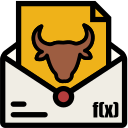

# OutboxKit

The goal of OutboxKit is to provide foundational features to assist in implementing the [transactional outbox pattern](https://blog.codingmilitia.com/2020/04/13/aspnet-040-from-zero-to-overkill-event-driven-integration-transactional-outbox-pattern/).

| Package | NuGet | Nightly Builds |
|---------|-------|----------------|
| Core    |  |  |
| Core.OpenTelemetry   |  |  |
| MySQL   |  |  |
| PostgreSQL   |  |  |
| MongoDB   |  |  |

> You can add the following [Feedz.io](https://feedz.io) source to your NuGet configuration to get the nightly builds: `https://f.feedz.io/yakshavefx/outboxkit/nuget/index.json`

Core ideas for this toolkit:

- focused - not trying to do many things, just focusing on doing one thing and doing it well (hopefully 🤞)
- unambitious - designed with specific uses cases in mind, not attempting to fit all possible scenarios
- customizable - while opinionated, there are a few knobs available to tweak, to simplify integration with different systems and preferences

## Why use this?

You probably shouldn't 😅. If possible, using more comprehensive libraries like [Wolverine](https://wolverinefx.net), [NServiceBus](https://particular.net/nservicebus), [Brighter](https://github.com/BrighterCommand/Brighter), [MassTransit](https://masstransit.io), etc, is probably a better idea, as they give a more integrated messaging experience (plus they've been at this for much longer, and in a wider range of scenarios). This toolkit is aimed at scenarios where greater degree of customization of the whole messaging approach is wanted.

## Docs

[OutboxKit docs](https://outboxkit.yakshavefx.dev)

## Misc

Logo by [@khalidabuhakmeh](https://github.com/khalidabuhakmeh)